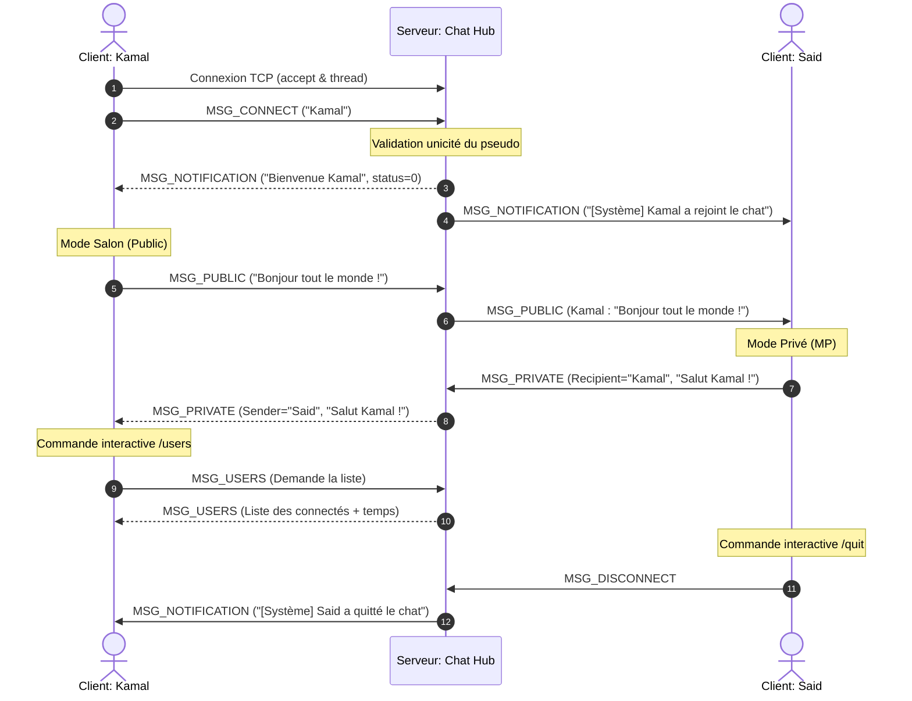

# Chat Hub - Application de Chat Centralisée en C (POSIX)

Bienvenue dans le projet **Chat Hub**, une application de discussion instantanée centralisée en temps réel basée sur une architecture **Client-Serveur** robuste en langage **C**. 

Ce projet a été développé dans le cadre du module de **Programmation Réseau (FSTS-GI)**. Il propose une architecture hautement concurrente capable de gérer un grand nombre de connexions simultanées sans aucun risque d'interblocage.

---

## 📸 Schéma d'Architecture & Protocole

Le diagramme ci-dessous illustre l'interaction asynchrone entre le serveur multithreadé (Chat Hub) et les différents clients connectés via le multiplexage I/O (`select`) :



---

## 🛠️ Choix Techniques Majeurs & Robustesse

### 1. Concurrence & Non-blocage (Absence d'interblocage)
* **Serveur Multithreadé (`pthread`)** : 
  Chaque client connecté est géré par un thread indépendant. Les accès à la liste globale des clients actifs sont strictement synchronisés par un verrou d'exclusion mutuelle (**Mutex** `clients_mutex`). Cela garantit qu'un client lent en lecture/écriture ou temporairement indisponible ne perturbe en aucun cas le fonctionnement du serveur ni les autres clients connectés.
* **Client Asynchrone Monothreadé (`select`)** :
  Côté client, le multiplexage I/O par la fonction système `select()` surveille en simultané :
  1. Le descripteur `STDIN_FILENO` (saisie de texte dans la console).
  2. Le descripteur `sock_fd` (réception de paquets du serveur).
  Cette approche évite la complexité et les risques d'une architecture multi-threadée côté client, tout en éliminant les blocages causés par les appels à `fgets()`.

### 2. Gestion de la Fragmentation TCP
Le protocole TCP transmet les données sous forme de flux continu d'octets sans limite de message inhérente. Si des paquets sont fragmentés ou agrégés par le réseau, les structures de données peuvent être lues de manière incomplète.
* **Solution** : Nous avons défini une structure de message à taille fixe (`ChatMessage`) et implémenté deux fonctions atomiques `send_all()` et `recv_all()`. Ces fonctions bouclent jusqu'à ce que la totalité des `sizeof(ChatMessage)` octets ait été transmise, évitant ainsi tout bug de corruption réseau.

### 3. Journalisation de l'historique
Toutes les actions majeures (connexions, déconnexions, messages publics, messages privés) sont horodatées à la seconde près, écrites sur la console du serveur et enregistrées de façon sécurisée dans le fichier `chat_history.log`.

---

## 💬 Commandes Client Supportées

Lorsqu'il est connecté au salon, un utilisateur peut saisir du texte standard ou l'une des commandes interactives suivantes :

| Commande | Rôle | Exemple d'utilisation |
| :--- | :--- | :--- |
| **`/users`** | Demander la liste des participants connectés avec leur horodatage. | `/users` |
| **`/msg <pseudo> <texte>`** | Envoyer un message privé uniquement au destinataire désigné. | `/msg Said Salut Kamal, comment ça va ?` |
| **`/quit`** | Déconnexion propre instantanée du serveur. | `/quit` |

---

## 🚀 Compilation & Exécution (sous Linux)

### 📋 Prérequis
* Un compilateur C (`gcc`)
* L'outil de construction `make`
* La bibliothèque standard des threads POSIX (fournie par défaut sous Linux).

### 1. Compilation
Placez-vous dans le répertoire du projet et compilez simplement en tapant :
```bash
make
```
Cette commande génère deux fichiers exécutables :
* `chat_server` : Le programme du serveur Chat Hub.
* `chat_client` : Le programme du client de discussion.

Pour nettoyer les fichiers compilés temporaires et repartir à zéro :
```bash
make clean
```

### 2. Lancement du Serveur
Lancez le serveur en spécifiant un port d'écoute optionnel (par défaut `5555`) :
```bash
./chat_server 5555
```
**Console attendue :**
```text
[2026-05-31 17:30:15] Serveur Chat Hub démarré avec succès sur le port 5555...
```

### 3. Lancement des Clients
Ouvrez de nouveaux terminaux et lancez un ou plusieurs clients en configurant l'IP et le port :
```bash
./chat_client --server 127.0.0.1 --port 5555
```
*(Remarque : Vous pouvez utiliser `--server localhost` comme équivalent).*

**Scénario d'utilisation type :**
```text
Pseudo : Kamal
[INFO] Connexion établie ! Bienvenue Kamal.
--- Astuce : tapez /users pour lister les participants, /msg <pseudo> <message> pour un MP, /quit pour quitter ---
Kamal> Bonjour tout le monde !
```

---

## 🧪 Scénarios de Test et Validation

1. **Test d'unicité de pseudo** : 
   Lancez un client `Kamal`. Lancez un second client et tentez d'entrer `Kamal`. Vous verrez instantanément : 
   `[ERREUR] Connexion refusée : pseudo invalide, vide ou déjà pris.` et le programme s'arrêtera proprement.
2. **Test de tolérance aux pannes** : 
   Fermez brutalement un terminal client (Ctrl+C). Le serveur affichera instantanément la déconnexion, libèrera les ressources associées (fermeture de socket), et notifiera les autres membres du chat sans aucune latence ni fuite mémoire.
3. **Test de synchronisation** : 
   Demandez la liste des membres connectés avec `/users` depuis n'importe quel client pour voir l'horodatage précis de connexion de chacun.
