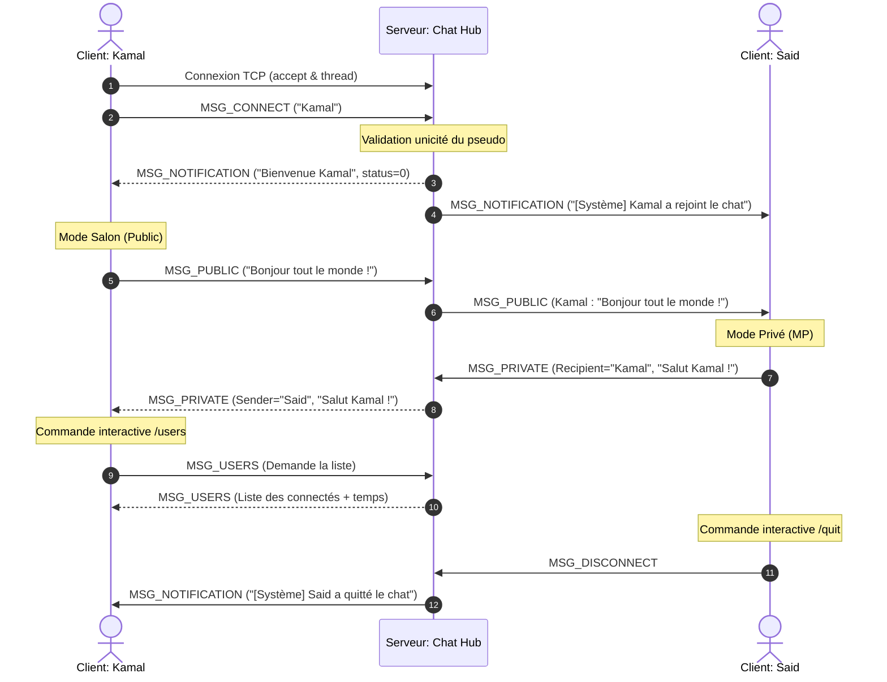

# 📘 Chat Hub - Projet de Programmation Système & Réseau (FSTS-GI)

Bienvenue dans le projet **Chat Hub**, une application de messagerie instantanée centralisée en temps réel basée sur une architecture **Client-Serveur** robuste et hautement concurrente écrite en langage **C** (POSIX).

Ce projet a été conçu et réalisé dans le cadre du module **Programmation Système et Réseau (FSTS-GI)**. Il met en œuvre des mécanismes avancés de synchronisation de threads, de multiplexage d'entrées/sorties et de gestion fine des flux réseau TCP.

---

## 📸 1. Schéma d'Architecture & Protocole

Le diagramme de séquence ci-dessous illustre le flux de communication asynchrone entre le serveur multithreadé (Chat Hub) et les différents clients actifs via le multiplexage E/S (`select`) :



---

## 🛠️ 2. Dépendances & Procédure d'Installation

### 📋 Prérequis et Dépendances
Le projet est entièrement conforme aux normes POSIX et ne nécessite aucune bibliothèque tierce complexe.
* **Système d'exploitation** : Environnement compatible POSIX (Linux, macOS, WSL sous Windows, ou environnement MSYS2/MinGW).
* **Compilateur** : `gcc` (supportant la norme C99).
* **Outil de build** : `make`.
* **Bibliothèque de threads** : POSIX Threads (`pthread`), généralement intégrée par défaut dans la bibliothèque standard C (`glibc`).

### 📦 Installation et Compilation
1. Décompressez l'archive du projet (ou clonez le dépôt).
2. Ouvrez votre terminal et placez-vous dans le répertoire du projet :
   ```bash
   cd atelier_prog_reseau
   ```
3. Compilez l'ensemble du projet avec la commande unique :
   ```bash
   make
   ```
   *Cette commande génère deux fichiers exécutables prêts à l'emploi : `chat_server` (le serveur) et `chat_client` (le client).*

4. Pour nettoyer les fichiers objets (`.o`) et les exécutables avant une nouvelle compilation :
   ```bash
   make clean
   ```

---

## 🚀 3. Instructions d'Exécution

Pour faire fonctionner le Chat Hub, vous devez impérativement lancer le serveur d'abord, puis y connecter un ou plusieurs clients.

### Étape 1 : Lancement du Serveur (`chat_server`)
Démarrez le serveur en spécifiant un port d'écoute optionnel (par défaut : `5555`) :
```bash
./chat_server 5555
```
**Console attendue sur le serveur :**
```text
[2026-05-31 20:30:15] Serveur Chat Hub démarré avec succès sur le port 5555...
```

### Étape 2 : Connexion des Clients (`chat_client`)
Ouvrez de nouveaux onglets ou fenêtres de terminaux et lancez les clients en configurant l'IP et le port :
```bash
./chat_client --server 127.0.0.1 --port 5555
```
*(Remarque : Vous pouvez utiliser `--server localhost` à la place de l'IP).*

Lors de la connexion, le client vous demandera de saisir votre pseudo. Une fois le pseudo validé par le serveur, vous pouvez commencer à dialoguer !

---

## 📡 4. Protocole de Communication & Description des Messages

Le protocole repose sur l'échange d'une structure réseau unique à taille fixe de **1096 octets** (`ChatMessage`), éliminant nativement la problématique de la fragmentation TCP.

### Structure de Données Commune (`common.h`)
```c
typedef struct {
    MsgType type;                   // Type de message (Enum)
    char sender[MAX_PSEUDO_LEN];    // Pseudo de l'émetteur (32 octets)
    char recipient[MAX_PSEUDO_LEN]; // Pseudo du destinataire (32 octets)
    char content[MAX_CONTENT_LEN];  // Corps du message (1024 octets)
    int status;                     // Statut ou code erreur (0 = OK, <0 pour erreur)
} ChatMessage;
```

### Description des Types de Messages (`MsgType`)

| Type de Message (`MsgType`) | Émetteur | Destinataire | Rôle |
| :--- | :--- | :--- | :--- |
| **`MSG_CONNECT`** | Client | Serveur | Demande d'authentification initiale en transmettant le pseudo désiré. |
| **`MSG_DISCONNECT`** | Client | Serveur | Notification de déconnexion propre déclenchée par la commande `/quit`. |
| **`MSG_PUBLIC`** | Client | Serveur/Clients | Message standard diffusé à tous les membres du salon de discussion. |
| **`MSG_PRIVATE`** | Client | Serveur/Client | Message privé ciblé vers un utilisateur particulier via `/msg <pseudo> <message>`. |
| **`MSG_USERS`** | Client | Serveur/Client | Demande de la liste des connectés et réponse contenant cette liste formatée. |
| **`MSG_NOTIFICATION`**| Serveur | Client | Notification système (message de bienvenue, alertes d'erreurs, arrivées/départs). |

---

## 🧠 5. Choix Techniques Majeurs & Difficultés Rencontrées

### A. Choix Techniques Majeurs
1. **Serveur Multithreadé (`pthread`)** : Chaque client connecté est pris en charge par un thread de travail dédié. Ce choix isole les connexions lentes ou défaillantes, préservant les performances globales du serveur.
2. **Synchronisation par Mutex** : L'accès au tableau centralisé des clients et à la console/historique est protégé par deux verrous mutex (`clients_mutex` et `log_mutex`) afin d'éviter tout accès concurrent incohérent ou corruption mémoire.
3. **Multiplexage côté Client (`select`)** : Le client s'appuie sur le multiplexage E/S pour surveiller en parallèle l'entrée standard (clavier) et la socket réseau, garantissant une réactivité maximale et immédiate de l'affichage.

### B. Difficultés Rencontrées & Solutions Apportées

#### 🚨 Difficulté 1 : Le blocage de l'interface utilisateur avec `fgets()`
* *Problème* : L'appel à `fgets()` sur `stdin` bloque le thread unique du client. Si le serveur envoie un message, celui-ci reste en attente dans les buffers de la socket et ne s'affiche pas à l'écran tant que l'utilisateur n'appuie pas sur *Entrée*.
* *Solution* : Remplacement de l'approche bloquante classique par un appel à la fonction système `select()`. Cela permet au client de "dormir" et de n'être réveillé que lorsqu'il y a effectivement des données à lire sur l'entrée clavier **OU** sur la socket réseau.

#### 🚨 Difficulté 2 : La fragmentation et l'agrégation des flux TCP
* *Problème* : TCP est un protocole orienté flux continu d'octets. Il n'assure pas que les paquets envoyés par `send()` soient reçus en un seul morceau par `recv()`. Un message peut arriver coupé en deux (fragmentation), ou deux messages peuvent fusionner dans un seul appel (agrégation).
* *Solution* : Définition d'une structure de message à taille fixe (`ChatMessage`) et implémentation de fonctions réseau utilitaires robustes `send_all()` et `recv_all()`. Ces fonctions effectuent une boucle jusqu'à ce que la totalité des `sizeof(ChatMessage)` octets soit transmise ou lue, garantissant l'intégrité des messages reçus.

---

## 🧪 6. Jeu de Tests (Scénarios de Validation)

Pour valider la conformité de l'application avec le cahier des charges académique, voici le protocole de tests à dérouler :

### 🧪 Scénario 1 : Contrôle d'unicité des pseudos (Robustesse)
1. Lancez un premier client avec le pseudo `Alice`.
2. Lancez un second client sur un autre terminal et saisissez également le pseudo `Alice`.
3. **Résultat attendu** : Le serveur refuse la connexion, renvoie un message d'erreur et le second client s'arrête proprement :
   `[ERREUR] Connexion refusée : pseudo invalide, vide ou déjà pris.`

### 🧪 Scénario 2 : Résilience face à une déconnexion brutale (Crash Client)
1. Connectez deux clients (`Alice` et `Bob`).
2. Tuez le terminal ou faites `Ctrl + C` sur le client `Alice`.
3. **Résultat attendu** : Le serveur détecte instantanément la fermeture du socket, libère le descripteur et supprime le client de sa table. Le client `Bob` reçoit une alerte système en temps réel :
   `[Système] Alice a quitté le chat.`

### 🧪 Scénario 3 : Envoi de message privé ciblé
1. Connectez `Alice` et `Bob`.
2. Depuis le terminal d' `Alice`, tapez : `/msg Bob Salut Bob, c'est confidentiel !`.
3. **Résultat attendu** : Seul `Bob` reçoit le message dans son terminal avec un formatage spécifique. Aucun autre client connecté ne peut intercepter ce message. Un écho local violet confirme à `Alice` le bon acheminement du message.

### 🧪 Scénario 4 : Persistance de l'historique (Logs)
1. Lancez une session de chat, échangez plusieurs messages puis arrêtez le serveur.
2. Ouvrez le fichier généré automatiquement `chat_history.log`.
3. **Résultat attendu** : L'ensemble des transactions (tentatives de connexion, arrivées, départs, messages publics et privés) est correctement horodaté et enregistré de manière pérenne.
